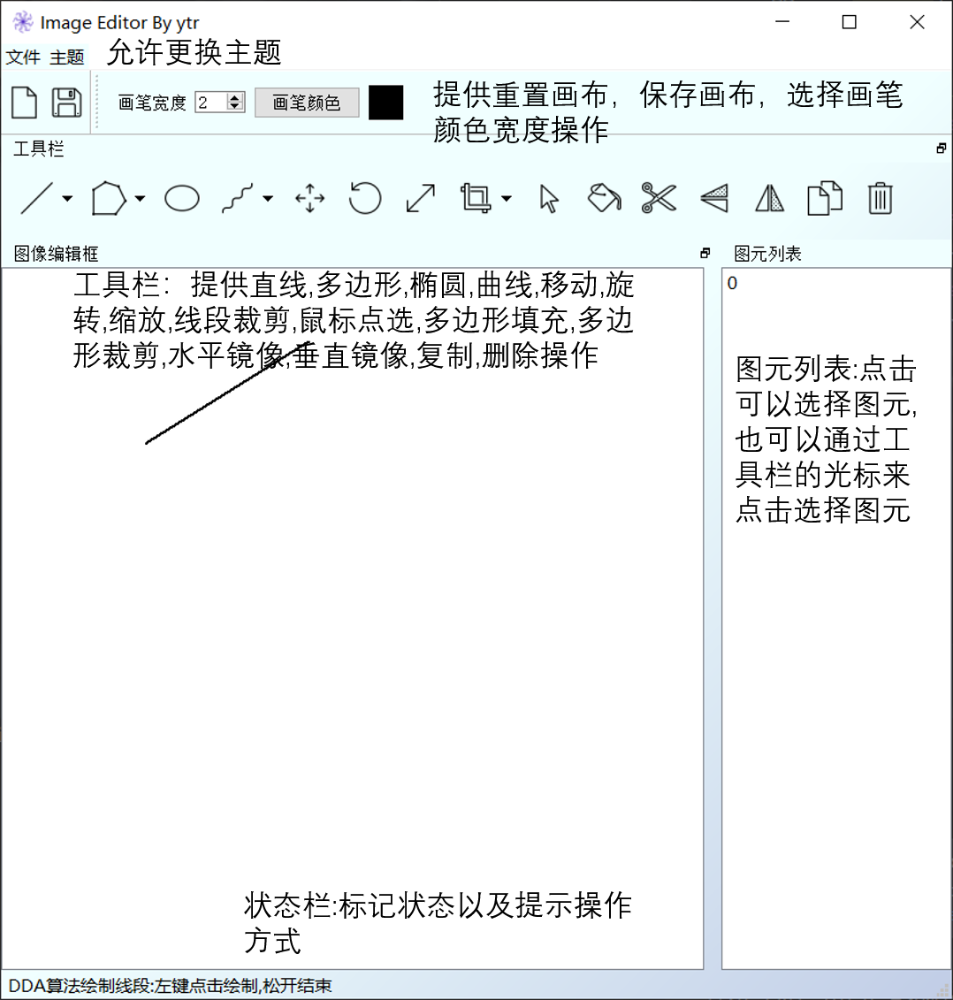
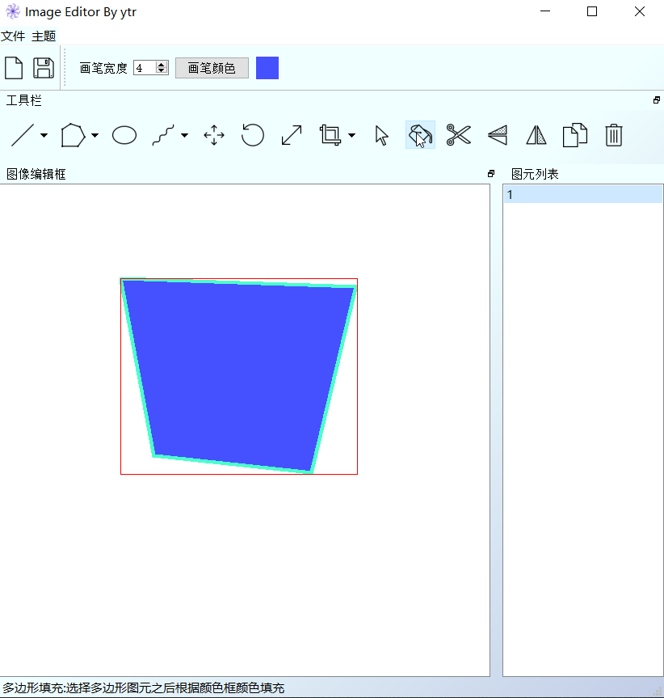
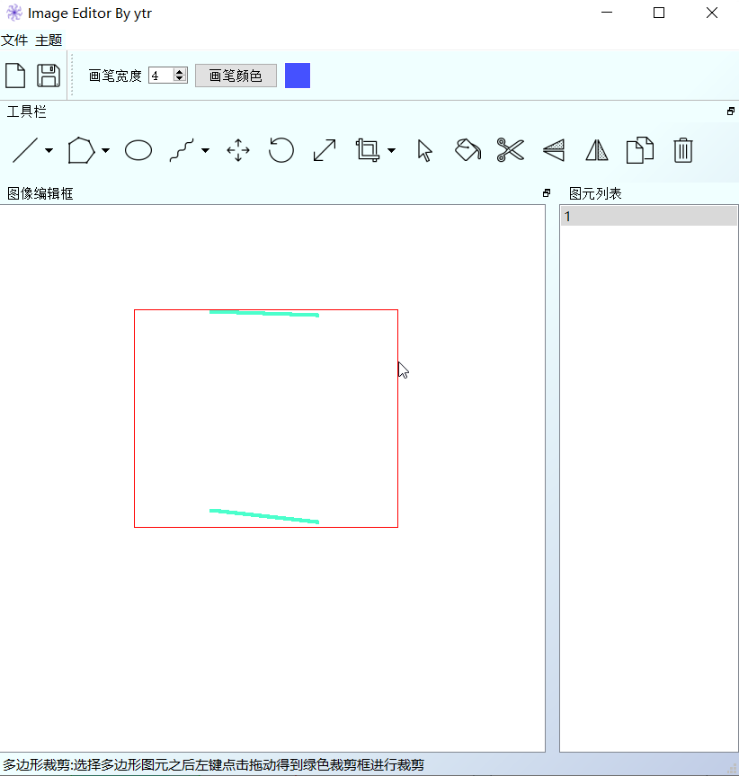

# README

具体算法以及实现见[报告]([https://github.com/Tyler-ytr/NJU_CV_project2020/blob/master/final_version/171240565_%E6%8A%A5%E5%91%8A.md](https://github.com/Tyler-ytr/NJU_CV_project2020/blob/master/final_version/171240565_报告.md))

## 系统使用说明书

[TOC]

### 开发环境

| 开发工具 | PyCharm Professional    |
| -------- | ----------------------- |
| 开发环境 | anaconda 4.8+pyqt 5.9.2 |
| 运行环境 | windows 10              |

### 运行说明

#### 总体布局说明

如下图所示,我的图形编辑器分目录,为画布操作-画笔选择区,工具栏,图像编辑框,图元列表;

在目录区可以选择文件目录进行重置画布和保存画布;在主题目录可以更换主题

在画布操作-画笔选择区可以选择相应图标进行重置画布,保存画布工作;可以选择画笔宽度以及修改画笔颜色

在工具栏按顺序提供了直线,多边形,椭圆,曲线,移动,旋转,缩放,线段裁剪,鼠标点选,多边形填充,多边形裁剪,水平镜像,垂直镜像,复制,删除操作;点击按钮之后下方状态栏就会同时操作的方式

图元列表是一种选择图元的方式,可以直接点击选中图元;当然也可以在工具栏使用鼠标点选工具;

这里有一个feature:被删除的图元在图元列表点击之后复制可以在原来的位置上出现一个新的图元,还是原来的样子;

我的图像编辑框是固定的大小,可以移动,浮动;工具栏也可以移动和浮动;

#### 设置画笔

点击画笔宽度的上下按钮就可以调整宽度,最小值为1;

点击画笔颜色就会弹出颜色对话框,从而可以进行颜色的选择;

#### 绘制直线

点击直线按钮就会默认以DDA算法进行直线的绘制,此时左键点击图像编辑框的任意一点然后拖动就会实时的画直线,松开之后完成绘制,图元列表也会多一项;

点击按钮旁边的下标键就可以选择其他算法了;

#### 绘制多边形

点击多边形按钮就会默认用DDA算法进行多边形绘制,此时左键点击图像编辑框的任意一点,就会设置一个控制点,然后再点击另外一点就会设置另外一个控制点……直到使用鼠标右键点击,之后会在图元列表添加图元;期间多边形会实时的绘制。另外点击工具栏的其他图标会自动地结束绘制,在图元列表添加图元;

同样多边形有两种算法,点击按钮旁边的下标就可以选择了;

#### 绘制椭圆

点击椭圆按钮,左键在图像编辑框任意一点点击获得第一个控制点,然后按住拖动,根据当前鼠标位置作为第二个控制点,实时绘制椭圆,松开鼠标设置第二个控制点完成绘制;

#### 绘制曲线

点击曲线按钮,左键在任意一点点击获得第一个控制点,然后继续左键点击获得第二个…………直到使用右键点击或者切换其他工具栏按钮完成绘制;

点击按钮旁边地下标可以切换算法,注意B-Spline得第三个控制点开始会出现绘制的曲线;

#### 平移图元

使用鼠标点选或者图元列表选择选中图元后,点击平移的按钮,鼠标发生变化;此时再次点击图像编辑框中的任意一点然后拖动就可以平移,松开即停止;如果还想移动,继续点击任意一点拖动即可;

#### 旋转图元

旋转图元适用于椭圆之外的所有图元;

按过旋转按钮之后,选择图元,在图像编辑框任意一点按住然后旋转就可以实时的旋转,松开鼠标结束;如果还想再次旋转可以继续按住一点然后旋转;

#### 缩放图元

按过缩放按钮之后,选择图元,然后再图像编辑框任意一点按住之后移动就可以实时的缩放,松开即完成;如果还想继续缩放可以按住一点然后继续缩放;

#### 线段裁剪

选中线段类型的图元之后,点击裁剪按钮,选择裁剪算法,然后在任意一点按住然后拖动就会出现蓝色的裁剪框,松开之后完成裁剪;

#### 鼠标点选

点击光标按钮,然后任意点选即可;

#### 多边形填充

选中一个多边形然后点击填充按钮就可以根据画笔颜色来填充啦！

注意:裁剪之后的多边形无法被填充;

#### 多边形裁剪

选中一个多边形然后点击裁剪按钮,点击图像编辑框任意一点然后拖动会出现绿色的裁剪框,松开就可以完成裁剪了;

注意:多边形可以多次裁剪,但是每一次都相当于对原来的多边形进行裁剪;经过裁剪之后的多边形无法被填充,不管是否完整;

#### 镜像操作

有水平镜像和垂直镜像两种,选中图元然后点击即可;

#### 复制粘贴操作

选择图元之后点击按钮就会在原来的位置复制一个一模一样的图元,下图为了演示还用了移动操作;

#### 删除操作

选中图元之后,点击就会删除图元;

注意:删除之后图元选择列表依然有这个图元标号,此时选中之后点击复制按钮可以在原来的位置再复制一个新的图元;

#### 更换主题

点击主题就可以更换主题了,目前支持两种主题:Blue theme和Coffee theme

