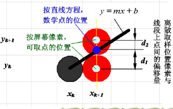
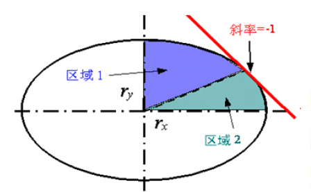
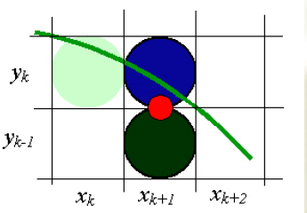
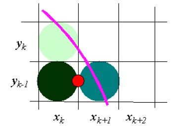
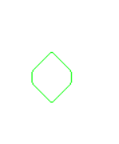
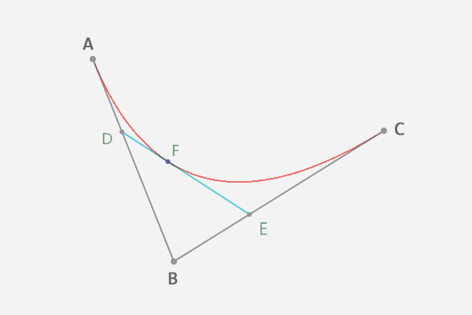
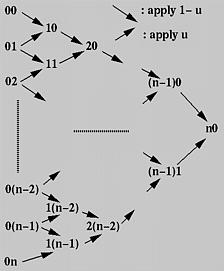
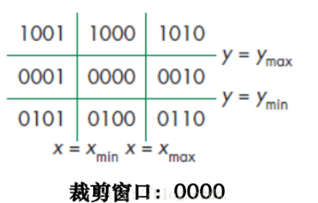
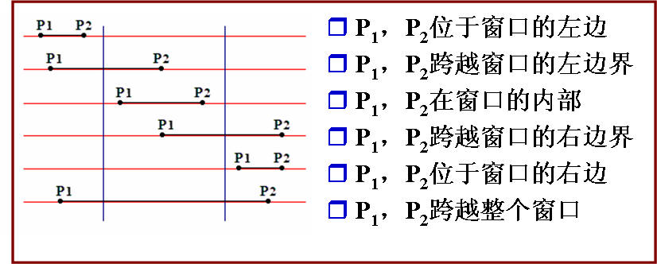

# 计算机图形学4月报告

作者:殷天润

电子邮箱:171240565@smail.nju.edu.cn

[TOC]

## 综述

本实验主要为了实现一个图形绘制系统，主要内容包括了底层算法实现，命令行系统完善和图形界面系统(pyqt)的实现;

根据大实验的具体要求，主要通过Python3完成了以下模块的内容:

- 核心算法模块:cg$\_$algorithm.py(除Liang-Barsky完成)

- 命令行界面程序:cg$\_$cli.py(完成)
- 用户交互界面(待做)

## 算法介绍

### 直线生成

#### DDA算法

DDA算法是计算机图形学基本的绘制直线算法,主要的思想来源于$y=kx+b$,显然,已知两个端点$(x_0,y_0),(x_1,y_1)$就可以知道k和b具体的值;

在已知k,b的情况下,只需要知道x,y中的一个就可以通过直线公式求到另一边的值;假设已知x,那么y=kx+b;假设已知y,那么x=(1/k)*(y-b)

实际操作中绘画直线是一个迭代的过程,如果使用DDA算法,相对于前一个点$(x_i,y_i)$,后一个点$(x_{i+1},y_{i+1})$可以记作:

- $$x_{i+1}=x_i+xStep$$

- $$y_{i+1}=y_i+yStep$$

yStep,xStep即步长是通过$dx=abs(x0-x1),dy=abs(y_0-y_1)$的比较确定的：

- 如果dx>dy,那么说明x轴方向上面两个点的距离更远,那么设置$xStep=1,yStep=k$
- 反之,说明y轴方向上面两个点的距离更远,设置$xStep=1/k,yStep=1$

当然在具体实现上面还需要考虑斜率为正无穷的情况和斜率为0的情况,这个时候进行特判就可以实现了;

不考虑上述情况的伪代码如下:(参考了Youtube)

````
Algorithm DDA(x1,y1,x2,y2){
	dx=x2-x1;
	dy=y2-y1;
	if(abs(dx)>abs(dy)){
		step=abs(dx);
	}else{
		step=abs(dy);
	}
	xStep=dx/step;
	yStep=dy/step;
	for(int i=1;i<=step;i++){
		putpixed(x1,y1);
		x=x1+xStep;
		y=y1+yStep;
	}
}
````

#### Bresenham算法

DDA算法具有的弊端在于浮点数运算的速度一般比较慢,Bresenham的好处就在于仅仅才用了整数增量运算;

下面进行Bresenham算法的推导:

假设起点是(x0,y0),终点是(x1,y1),那么斜率m为$\frac{y1-y0}{x1-x0}=\frac{dy}{dx}$；

然后因为在画图的时候实际上的点是整数的,和线段真实的有偏差,实际决策的时候就需要找到更加接近于真实点的那个整数点;如果固定xk,那么这个整数点的选择就在yk和yk+1两者之间展开:

以x为决策的直线为例:

对于直线y=mx+c,已知下一个x,xnext=xk+1,那么真实的y=m(xk+1)+c

- $d1=y-yk=m(xk+1)+c-yk$
- $d2=yk+1-y=yk+1-m(xk+1)-c$

显然,如果d1-d2<0,yk距离y更近,选择yk;如果d1-d2>0,yk+1距离y更近,选择yk+1；



观察到d1-d2=m(xk+1)+c-yk-(yk+1-m(xk+1)-c)=2m(xk+1)-2yk+2c-1；

将上面的式子中的m转换成$dy/dx$,然后再在两边乘dx,可以得到:

$dx(d1-d2)=dx(2*\frac{dy}{dx}(xk+1)-2yk+2c-1)$

整理得到:

$dx(d1-d2)=2dy(xk+1)-2dxyk+2dxc-dx$

事实上上面的式子中只有$2dyxk-2dxyk$不是常数,因此整理得到了决策变量$p_k$:

$p_k=2dyx_k-2dxy_k+(2dy+2dxc-dx)=2dyx_k-2dxy_k+c$

因为dx大于0,因此$p_k$和(d1-d2)实际上是同号的,因此可以得到如下的结论:

- 如果$p_k>0$,那么$d1-d2>0$,$y_k+1$距离真实的y更接近,选择$(x_{k+1},y_k+1)$;
- 如果$p_k<0$,那么$d1-d2<0$,$y_k$距离真实的y更接近,选择$(x_{k+1},y_k)$;

关于$p_k$的计算同样可以变成一个迭代的过程:

根据$p_k$的公式,不难得到:$p_{k+1}=2dyx_{next}-2dxy_{next}+c$

相减可以得到:$p_{k+1}-p_k=2dy(x_{next}-x_k)-2dx(y_{next}-yk)$

通过这个式子,$p_k$取值以及决策变量的选择(也就是$x_{next}=x_k+1$还是$y_{next}=y_k+1$),就可以知道决策参数的增量公式;

假设斜率是0-1,也就是$x_{next}=x_k+1$,$y_{next}=y_k~or~y_k+1$：

- 如果$p_k>0$,$y_{next}=y_k+1$,$p_{k+1}=p_k+2dy-2dx$
- 如果$p_k< 0$,$y_{next}=y_k$,$p_{k+1}=p_k+2dy$

下面是初始化的时候决策参数$p_0$的推导:

对于y=mx+c:

$c=y_0-\frac{dy}{dx}x_0$

$p_0=2dyx_0-2dxy_0+2dy+2dxc-dx$

综合两个式子得到:

$p_0=2dyx_0-2dxy_0+2dy+2dx(y0-\frac{dy}{dx}x0)-dx=2dy-dx$

综上,当直线斜率为0-1的时候($x_{next}=x_k+1 $),Bresenham的算法流程处理如下:


1. 选择起始点$(x_0,y_0)$,终止点$(x_1,y_1)$,保证终止点中x1>x0,否则交换;计算得到$dx=x_1-x_0,dy=y_1-y_0;p_0=2dy-dx$

2. 从k=0,已知$(x_k,y_k),p_k$,计算下一个要画的点$(x_{k+1},y_{k+1})$以及决策变量$p_{k+1}$:

   $x_{k+1}=x_k+1$;

   - 如果$p_k>0,y_{k+1}=y_k+1.p_{k+1}=p_k+2dy-2dx$
   - 如果$p_k<=0,y_{k+1}=y_k,p_{k+1}=p_k+2dy$

3. 循环直到$x_k=x1$;

当斜率为其他的时候,其实改变的主要是决策变量,决策变量的更新,以及附属的变量的更新,主要是一些正负号的问题;其中当斜率为正无穷和0的时候需要像处理DDA算法一样进行特判;

### 多边形的生成

多边形只需要通过给定的一系列点，多次调用直线生成算法就可以完成了！

### 椭圆的生成    中点圆生成算法

主要思想是,首先考虑椭圆中心如果在原点时候的情况,然后计算出第一象限内的点,通过平移和对称操作得到椭圆所有点应该在的位置；

已知椭圆的函数如下:

$$f(x,y)=r_y^2x^2+r_x^2y^2-r_x^2r_y^2$$

当$f(x,y)<0$的时候,$(x,y)$在椭圆内部;当$f(x,y)>0$的时候,$(x,y)$在椭圆外部;

和直线算法相近的是,中点圆生成算法也要考虑决策变量是x,还是y,并且同样也是根据斜率来进行判断的;

根据椭圆的函数可以得到椭圆的斜率为$\frac{dy}{dx}=2r_y2x/2r_x2y$;因此可以通过这个公式将椭圆划分成切线斜率绝对值小于1的区域1,和切线斜率大于1的区域2,区域交替条件就是$2r_y2x\geq2r_x2y$



下面是主要算法的流程:

不妨从$(0,r_y)$顺时针开始生成椭圆,先生成区域1的点,然后生成区域2的点;

在区域1中,因为斜率绝对值小于1,因此决策变量是x,假设$(x_k,y_k)$是第k步确定的点,那么下一个取样的位置$x_{k+1}$有两个选择:




如何选择$y_{k+1}$同样是根据决策参数$p1_k$来进行的,这里取样处于两个候选像素中间的点对椭圆参数求值:

$p1_k=f(x_{k+1},y_k-\frac{1}{2})=r_y^2(x_k+1)^2+r_x^2(y_k-\frac{1}{2})^2-r_x^2r_y^2$

- 当$p1_k<0$的时候,中点在椭圆的内部,选择$(x_{k+1},y_k)$

- 当$p1_k\geq  0$的时候,中点在椭圆的外部,选择$(x_{k+1},y_k+1)$;

其中决策参数$p1_k$也是可以通过迭代过程来得到的:

- 若$p1_k<0$: $p1_{k+1}=p1_{k}+2r^2_yx_{k+1}+r^2_y$
- 若$p1_k\geq 0$: $p1_{k+1}=p1_{k}+2r^2_yx_{k+1}-2r_x^2y_{k+1}+r^2_y$

这里$p1_0=r_y^2-r_x^2r_y+r^2_x/4$

循环直到$2r_y^2x\geq 2r_x^2y$时进入区域2;区域2中,切线的斜率绝对值小于1,因此决策变量是y;同理从$(x_k,y_k)$到下一个点$(x_{k+1},y_{k+1})$的推导如下:

$y_{k+1}=y_k-1$

$p2_k=f(x_{k}+\frac{1}{2},y_k-1)=r_y^2(x_k+\frac{1}{2})^2+r_x^2(y_k-1)^2-r_x^2r_y^2$



- 当$p1_k<0$的时候,中点在椭圆的内部,选择$(x_{k}+1,y_k-1)$,$p2_{k+1}=p2_{k}+2r^2_yx_{k+1}+r^2_x$
- 当$p1_k\geq 0$的时候,中点在椭圆的外部,选择$(x_{k},y_k-1)$,$p2_{k+1}=p2_{k}+2r^2_yx_{k+1}-2r_x^2y_{k+1}+r^2_x$

这里$p2_0=r_y^2(x_1+\frac{1}{2})+r_x^2(y_1-1)^2-r^2_xr_y^2$

循环到$(r_x,0)$就完成了第一象限椭圆的绘制了;然后通过对称,平移操作就可以得到整个椭圆了;

**在实现的时候遇到的小问题**

在实现的时候我书写区域边界的时候ry没有平方,就会产生以下的图形:



### 曲线的生成

#### Bezier曲线

我是用了一个迭代的算法，De Casteljau’s Algorithm 来绘制Bezier曲线;

- 首先是对Bezier曲线的理解:

  Bezier曲线本质上是在控制点连接的线段上,按照某一个比例(u:0-1)，取到一组分割点,然后连接分割点，再按照这个比例取分割点……直到取的点只有一个了，就得到了相应参数u对应的曲线上的点;



​	以上图为例:这里A,B,C就是三个控制点,第一次根据u分割得到了D,E,这里D,E满足:

​	$\frac{AD}{AB}=u=\frac{BE}{BC}$

​	然后根据D,E进行第二次的分割得到F,这里F满足:

​	$\frac{DF}{DE}=u$

​	不难看出当u从0按照某个步进循环到1，就可以绘制出相应的曲线

- De Casteljau’s Algorithm的思想是: 为了计算第n次贝塞尔曲线的点C(u),$u\in [0,1]$，首先需要将控制点连成一条折线,00-01-02....0(n-1)-0n;然后利用上面的方法得到0j-0(j+1)上的分割点1j,使得1j分该线段的比值为u:1-u;然后在折线10-11.....1(n-1)上面递归调用该算法,以此类推直到n0;上述的方法可以直观的表示成下图:

  

  因此不难发现,通过第0列就可以得到第1列,然后得到第2列…………,经过n次迭代之后可以得到唯一的n0点;

  这个计算过程可以用伪代码书写如下:

  ````
  Input: P[0:n] 表示n+1个点, 实数u表示分割的比例,u在[0,1]中
  Output: 曲线上的点C[u]
  Working: 
  Q[0:n]
  for(int i=0;i<=n;i++){
  	Q[i]=P[i]
  }
  for(int k=1;k<=n;++k){
  	for(int i=0;i<=n-k;i++){
  		Q[i]=(1-u)*Q[i]+u*Q[i+1];
  	}
  }
  
  return Q[0];
  ````

  根据这个伪代码,只要确定u的步长就可以得到所有的曲线了;

#### B样条曲线

Beizer曲线之中,只要改动一个点就会牵扯到整个曲线,可谓牵一发而动全身,B样条曲线则具有很好的局部修改特性;

我主要使用了 de Boor-Cox 算法完成了对于3次B样条曲线的绘制,下面首先讲解B样条曲线,然后涉及具体的算法;

- B样条曲线的定义是: 给定n+1个控制点$\{P_0,...,P_n\}$和m+1个节点$\{u_0,..u_m\}$,k阶B样条曲线$C(u)=\sum^n_{i=0}B_{i,k}(u)P_i,u\in[u_{k-1},u_{k+1}]$；

- 其中de Boor-Cox 算法中,对于B的递推定义如下:
  $$
  B_{i,1}(u)=\left\{
  \begin{aligned}
  1 & ~u_i<x<u_{i+1} \\
  0 & ~Otherwise 
  \end{aligned}
  \right.
  $$

  $$
  B_{i,k}(u)=\frac{u-u_i}{u_{i+k-1}-u_i}B_{i,k-1}(u)+\frac{u_{i+k}-u}{u_{i+k}-u_{i+1}}B_{i+1,k-1}(u)
  $$

  通过这个递推定义的公式,然后结合B样条曲线定义的公式,可以得到B样条离散点的一个递推计算公式:
  $$
  P_{i}^r(u)=\left\{
  \begin{aligned}
  &P_i & ~r=0 \\
  &\lambda_i^r(u)P_{i}^{r-1}(u)+(1-\lambda_i^r(u))P_{i-1}^{r-1}(u) & ~i=j-k+r+1,..,j 
  \end{aligned}
  \right.
  $$
  其中$j\in[k-1,n-1],u\in[u_j,u_{j+1})$

  以及:
  $$
  \lambda_i^r(u)=\frac{u-u_i}{u_{i+k-r}-u_i}~~(r=0,1,2,..,k-1)
  $$

- 不难看出B样条曲线和Bezier曲线是非常相似的,主要的变化是u变成了$\lambda_i^r(u)$;观察上面的式子同样可以发现,对于某一个3次B样条曲线的点$P_j^3$,与它关联的控制点实际上只有$P_j^0,P_{j-1}^0,P_{j-2}^0,P_{j-3}^0$,这也是B样条曲线局部控制能力的原因;

- 根据上述分析结合Bezier曲线的伪代码,就不难写出B样条曲线的代码了;

### 图元的平移

图元的平移主要实现我认为有两种:

1. 根据相应的id找到相应的已经画出来的点,把之前画的擦掉,然后将这些点都进行平移操作;
2. 直接修改图元的参数,然后绘制的时候直接根据已经平移了的参数进行绘制

显然,第一种需要额外的存储相应图元的点的位置,以及需要画两次图元,开销更大一点,因此我在具体实现的时候选择的是第二种策略进行图元参数的变换然后再进行绘制;

### 图元的旋转

具体推导是先考虑以原点为中心进行旋转的情况，然后考虑以任意点为中心进行旋转的情况;

假设以原点为中心，逆时针旋转n度,原来的点是A$(x_1,y_1) $:

首先求半径R=OA=$\sqrt{x_1^2+y^2_1}$,因此可以得到原来的A的极坐标表示:$(R\cos\theta,R\sin\theta)$,因此可以得到如下关系:

$\cos\theta=\frac{x_1}{R}$,$\sin\theta=\frac{y_1}{R}$

逆时针旋转n度后:

$x'=R\cos(\theta+n)=R(\cos\theta\cos n-\sin\theta\sin n)=x1\cos n-y1\sin n $

$y'=R\sin(\theta+n)=R(\sin \theta \cos n+\cos \theta \sin n)=y1\cos n+x1\sin n$

现在通过上面的公式不难得到绕$(x_0,y_0)$旋转的公式:

$x'=x_0+(x_1-x_0)\cos n-(y_1-y_0)\sin n $

$y'=y_0+(y_1-y_0)\cos n+(x_1-x_0)\sin n$

### 图元的缩放

具体推导先假设以原点为中心的情况进行缩放，然后考虑以任意点为中心进行缩放

对于$(x_0,y_0)$,缩放倍数为s时:

$x'=s*x_0,y'=s*y_0$

那么对于以$(x_1,y_1)$为中心点进行缩放时:

$x'=x_0*s+x,y'=y_0*s+y$

### 线段的裁剪

#### Cohen-Sutherland算法

线段的裁剪主要目的是根据给定的左下点$(x_{min},y_{min})$和右上角点$(x_{max},y_{max})$得到的矩形来对已知的线段两端点$(x_0,y_0),(x_1,y_1)$进行修正;如果在矩形内则不变,如果在矩形外则舍弃,如果一部分在矩形外则求线段和矩形的交点作为新的线段端点返回;

我认为Cohen-Sutherland的妙处就在于用位数运算来确定9个状态,大大减小了用于判断状态的开销:



具体而言的编码规则如下:

- 若$y>y_{max}$,则第1位置为1,否则为0
- 若$y<y_{min}$,则第2位置为1,否则为0
- 若$x>x_{max}$,则第3位置为1,否则为0
- 若$x<x_{min}$,则第4位置为1,否则为0

通过这样的编码就可以得到点在具体哪一个区域,具体实现的Python代码如下:

````python
def Checklocation(x, y, x_min, y_min, x_max, y_max) -> int:
    result = 0
    INSIDE = 0  # 0000
    LEFT = 1  # 0001
    RIGHT = 2  # 0010
    BOTTOM = 4  # 0100
    TOP = 8  # 1000

    result = INSIDE

    if x < x_min:
        result = result | LEFT
    elif x > x_max:
        result = result | RIGHT
    if y < y_min:
        result = result | BOTTOM
    elif y > y_max:
        result = result | TOP
    return result
````

根据上面算法计算到的两个点的位置信息(outcode1,outcode2)可以得到以下几种情况:

1. outcode1=outcode2=0 (outcode1|outcode2==0)表示两个点都在矩形里面,无须裁剪;
2. (outcode1&outcode2)!=0 表示两个点都在同一个远离矩形的方向,比如1001和0001,此时线段在矩形的外面,可以舍弃;
3. 当不是上述情况的时候,线段一定会和矩形有交点,要么有一个要么有两个,我采取的方案是用一个while循环,每一次修改在矩形外面的一个点,修改完这个点之后重新进入循环,查看是否已经进入状态1,如果没有就再次修改;

计算与矩形边界的交点只需要根据y=kx+b就可以轻松算到了

#### Liang-Barsky 算法

1. 该算法和Cohen-Sutherland算法相比，状态判断的更少，带来的结果就是算法更快！

2. 这个算法的基本思路是：把待裁剪线段和裁剪窗口都看作是一维的点集，裁剪结果就是两点集的交,这种思想用公式解释如下:
	$$
P=P_0+u(P_1-P_0)
	$$
	其中$P_0,P_1$是两个固定的点,因此P其实仅仅取决于u,原来下线段中u的取值是0-1,那么通过裁剪的窗口来得到取交集的u的值,就是这个算法的核心内容;其中,将二维的裁剪窗口转化成的一维的点集称作“诱导窗口"
	
3. 直线和裁剪窗口的四个边界有四个交点,记作$Q_i(i=1,2,3,4)$,对应$x_{min},y_{min},x_{max},y_{max}$，这四个交点中的两个成为诱导窗口(直线在范围内),关键在于如何定位这两个点;我觉得宏观来看有点像一种夹逼的思想，从无限远的两边往中间夹逼，找到最”中间“的两点就是要找的窗口;

4. 一维裁剪窗口的关系如下图:

   

   当且仅当下面的式子成立的时候线段和裁剪窗口存在公共部分:
   $$
   max(min(x_0,x_1),x_{min})\leq min(max(x_0,x_1),x_{max})
   $$
   也就是左端点中大者<=右端点中的小者;
   
5. 二维窗口沿用了一维窗口的思想,通过计算裁剪窗口延长线和线段的所在直线的交点,就可以得到相应的u值,这个u值和上面一维的x值很相似,运用相似的手法可以得到要的结果

6. 具体的操作步骤如下:

   1. 定义:

      ````py
      dx = x1 - x0
      dy = y1 - y0
      p = [0 for _ in range(5)]
      q = [0 for _ in range(5)]
      p[1] = -dx
      p[2] = dx
      p[3] = -dy
      p[4] = dy
      q[1] = x0 - x_min
      q[2] = x_max - x0
      q[3] = y0 - y_min
      q[4] = y_max - y0
      ````

      因此不难得到:$u_i=p_k/q_k$

   2. 对每一个k=1,2,3,4,判断$p_k$：
   
      1. $p_k<0,u_1=max(u_1,q_k/p_k)$
      2. $p_k>0,u_2=max(q_k/p_k)$
      3. 如果$p_k==0 ~and~q_k<0$,说明不在窗口内
      4. 如果$u_1>u_2$说明不存在返回;
   
   3. 将更新的$u_1,u_2$带入得到要求的点;

## 系统介绍

To be done

## 总结

To be done

## 参考文献

孙正兴. 计算机图形学讲义. 2020

**DDA算法**

DDA算法和Bresenham算法 https://blog.csdn.net/u010429424/article/details/77834046

DDA Line Drawing Algorithm - Computer Graphics$~$ https://www.youtube.com/watch?v=W5P8GlaEOSI

**Bresenham算法**

Bresenham's Line Drawing Algorithm$~$https://www.youtube.com/watch?v=RGB-wlatStc&t=415s

图形学笔记: Bresenham画线算法$~$https://segmentfault.com/a/1190000002700500

**Bezier曲线**

德卡斯特里奥算法（De Casteljau’s Algorithm）绘制贝塞尔曲线$~$https://blog.csdn.net/Fioman/article/details/2578895

 计算机图形学bezier曲线曲面B样条曲线曲面 $~$https://www.bilibili.com/video/av33675067?p=15
清华大学-计算机图形学基础（国家级精品课） https://www.bilibili.com/video/av66548502?p=11

Bezier曲线(1)：Introducion https://blog.csdn.net/u013213111/article/details/94067849

**B样条曲线**

计算机图形学bezier曲线曲面B样条曲线曲面 https://www.bilibili.com/video/av33675067?t=4&p=22
B-Spline(六):给定参数求点(de Boor 算法) http://www.whudj.cn/?p=535
如何绘制三次B样条曲线 https://blog.csdn.net/qingcaichongchong/article/details/52797854

**图元的旋转**

【数学】在平面中，一个点绕任意点旋转θ度后的点的坐标 - 【旋转变换 旋转矩阵】 https://blog.csdn.net/LearnLHC/article/details/93623031

**Cohen-Sutherland算法**
Cohen–Sutherland算法 https://www.jianshu.com/p/d512116bbbf3
Cohen-Sutherland算法概述 https://www.omegaxyz.com/2018/10/29/cohen-sutherland/

**梁友栋-Barsky裁剪算法** 

梁友栋-Barsky裁剪算法 https://www.cnblogs.com/jenry/archive/2012/02/12/2347983.html

理解梁友栋-Barsky裁剪算法https://blog.csdn.net/Daisy__Ben/article/details/51941608